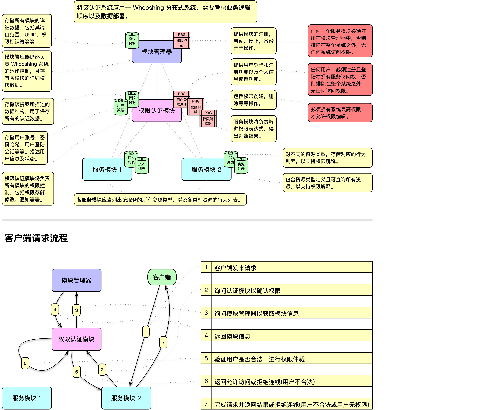
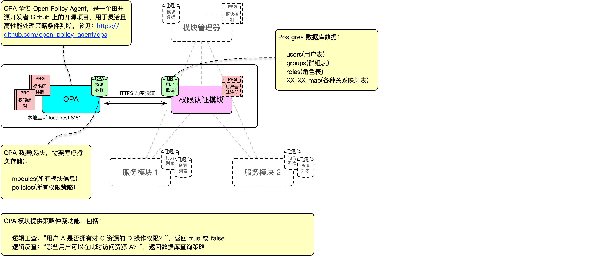
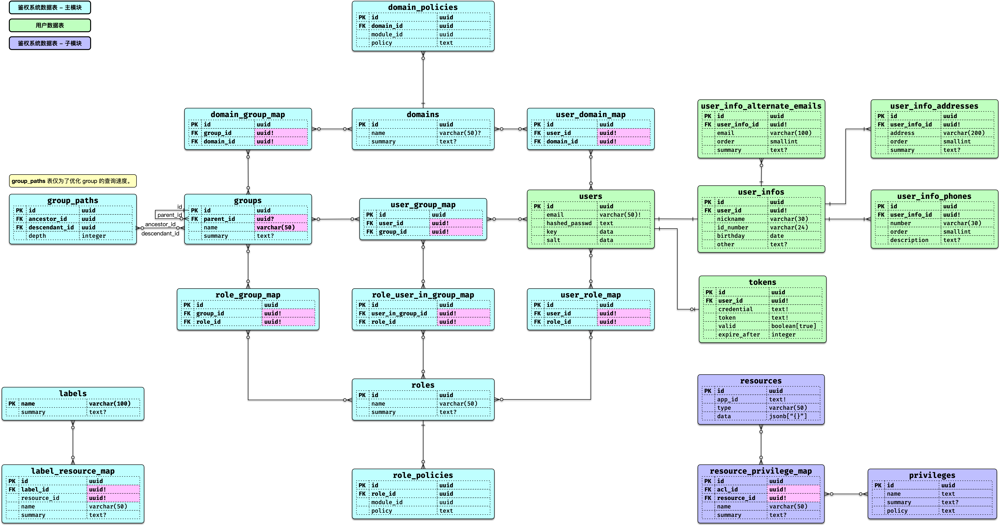

# Whooshing 权限管理依赖库

本项目为 [Whooshing](https://github.com/SJJC-Team/whooshing) 系统的**权限管理依赖库**，负责维护 **权限管理的数据结构**，并为 Whooshing 系统及其各服务模块提供全面的 **访问控制与权限管理** 功能。

它涵盖了 **权限授予、群组权限、用户权限、资源访问限制** 等多个层面，为系统提供灵活、高度可扩展的零信任权限及基于策略的自动化仲裁解决方案。

---

### 特性

- **灵活的权限定义**：权限以 Rego 表达式形式定义与解析，支持复用与组合，满足复杂业务需求。
- **严格的访问控制**：遵循最小权限原则，采用基于策略（Policy-based）的访问机制，利用 [OPA (Open Policy Agent)](https://www.openpolicyagent.org/) 进行实时仲裁，确保安全边界清晰。
- **高度可定制**：允许自定义资源类型及其操作集合，从而实现极高颗粒度的精细化权限管理。
- **结构化权限体系**：支持用户、群组及群组内权限层级定义，构建清晰的权限继承与隔离模型。
- **分布式架构设计**：采用分布式思路实现低耦合的模块交互。全局享有唯一的 `PrivilegeSystem` 处理账号与群组，各个服务模块持有独立的 `PrivilegeModule` 处理本地资源。
- **模块化实现**：以模块为单位组织功能，职责边界明确，便于扩展与维护。

---

### 结构设计

系统由核心系统控制器、子服务模块控制器以及 OPA 服务协同组成。

#### 模块业务及数据部署

全局统一认证系统分配全局角色及全局策略；业务模块挂载专属资源与相关权限。当仲裁请求发起时，合并各方策略由 OPA 进行终裁。



#### OPA 模块同步



#### 数据结构 - ERD



要了解详细结构，请见[所有设计图](diagrams)

---

### 导入该依赖库

在你的 `Package.swift` 加入：

```swift
.package(url: "https://github.com/whooshing-workshop/whooshing.toolbox-privilege-system", from: "1.0.2")
```

在依赖模块中引入:

```swift
.product(name: "PrivilegeSystem", package: "whooshing.toolbox-privilege-system"),
.product(name: "PrivilegeModule", package: "whooshing.toolbox-privilege-system")
```

在需要的地方导入:

```swift
import PrivilegeSystem
import PrivilegeModule
```

---

### 使用介绍

#### 1. 系统与模块初始化

要进行权限管理，你需要分别启动 **全局系统** (`PrivilegeSystem`) 与 **业务模块** (`PrivilegeModule`)。通常这会在服务启动或中间件中进行。

```swift
import PrivilegeSystem
import PrivilegeModule

// 初始化全局权限系统 (负责用户、群组、全局角色等)
let system = try await PrivilegeSystem(
    eventLoop: eventLoop,
    dbConfigure: postgresConfigure,          // 数据库配置
    opaConfigure: .init(port: 8181),         // OPA 配置
    logger: .init(label: "PrivilegeSystem")
)

// 声明该模块下允许存在的资源类型集合
enum ResourceList: String, ResourceTypeList {
    case document
    case record
}

// 初始化您的业务服务权限模块 (负责此模块自有的资源与策略)
let module = try await PrivilegeModule<ResourceList>(
    moduleId: UUID(),                        // 您的模块唯一标识符
    eventLoop: eventLoop,
    dbConfigure: modulePostgresConfigure,
    opaConfigure: .init(port: 8181),
    logger: .init(label: "MyServiceModule")
)
```

#### 2. 账号注册与鉴权准备

创建新用户并获取用户的 DTO：

```swift
let user = try await system.account.register(
    for: .init(
        email: "readme_user@example.com",
        hashedPassword: try Crypto.hash("SecurePassword123").get()
    )
)
```

#### 3. 注册资源与资源策略

业务模块独立管理其下的私有资源。你可以向模块中注册任何想要保护的实体。

```swift
import AnyCodable

// 创建代表特定文档的资源 (需要符合模块预设的资源类型，并包装为 PM.ResourceDTO)
let docResource = JsonResource(
    name: "Secret_Doc",
    content: ["isPrivate": AnyCodable(true)]
)

// 资源落库
let resourceDTO = try await module.resource.create(
    resources: OrderedSet<docResource>
).first!
let anyResourceDTO = AnyResource(resourceDTO)!

// 编写您的 Rego OPA 策略，以拦截不合规的操作
let myPolicy = """
allow if {
    input.operation == "read"
}
"""

// 在系统内注册权限，并将其挂载至资源上
let privilegeDTO = try await module.privilege.createWithReturning(
    privileges: [PM.PPrivilege(name: "doc_reader", summary: "Read documents", policy: myPolicy)]
).first!

// 将权限和具体资源双向绑定 (attach)
try await module.privilege.attach {
    [privilegeDTO] => [anyResourceDTO]
}
```

#### 4. 创建角色与人员指派

为用户分配职能（即“角色”）。角色本身也可以附加策略，作为请求资源时的基础门槛。

```swift
// 创建名为 "Document Viewer" 的角色
let role = try await system.role.create(
    roles: [.init(name: "Document Viewer", summary: "Can view docs")]
).first!

// 为角色分配额外的全局门槛策略 (可选)
let rolePolicy = """
allow if { true }
"""
let rolePolicyDTO = try PPolicy<Role>(moduleId: module.moduleId, policy: rolePolicy)
let _ = try await system.policy.create(to: Role.self) {
    [rolePolicyDTO] => role.id
}

// 指派角色到用户身上
try await system.role.appoint {
    [role] => [user]
}
```

#### 5. 权限仲裁 (Arbitrator)

当用户发起请求时，使用仲裁器结合当前用户、其所在的角色群组、请求的具体资源以及 OPA 策略，得出最终许可。

```swift
// 尝试对资源进行 `read` 操作
let readResult = try await system.arbitrator.judge(
    moduleId: module.moduleId,
    user: user,
    role: role,
    resource: anyResourceDTO,
    operation: .init(op: JsonOperation(rawValue: "read")!),
    privilegeIds: [privilegeDTO.id]
)

print(readResult.result) 
// -> true (由于符合 "read" 操作要求，且角色验证通过)

// 尝试对该资源进行未许可的 `write` 操作
let writeResult = try await system.arbitrator.judge(
    moduleId: module.moduleId,
    user: user,
    role: role,
    resource: anyResourceDTO,
    operation: .init(op: JsonOperation(rawValue: "write")!),
    privilegeIds: [privilegeDTO.id]
)

print(writeResult.result) 
// -> false (策略拦截)
```

> **提示:** 仲裁器会直接与 OPA 进行高性能通信，并将相关资源的元数据带入环境，无需您手动解析复杂的依赖网。所有的权限判定操作对于应用逻辑都是无感且绝对一致的。

#### 6. 类型安全的查询 (Query DSL)

PrivilegeSystem 提供了一套基于 Fluent 构建的高级类型安全查询 DSL。它允许你直接使用 DTO 的 KeyPath 进行数据过滤、排序和连接，而无需直接接触底层的数据库模型。此外，系统针对 `PropertyWrapper` (例如 `IDProperty`, `FieldProperty`) 和各类聚合查询 (如 `sum`, `average`) 也提供了完善的封装映射。

```swift
// 通过系统查询用户，支持安全类型推断
let users = try await system.query(QUser.self)
    .filter(\.email == "readme_user@example.com")
    .sort(\.createdAt, .descending)
    .limit(10)
    .all()

// 支持基于中间表 (Pivot) 的 Join 查询
let joined = try await system.query(QUser.self)
    .join(UserTRole.self, on: \.id == \.userId)
    .fields(for: UserTRole.self) // 自动拉取 Join 产生的新字段
    .filter(UserTRole.self, \.roleId == role.id)
    .all()
```

---

### 高阶特性

#### 丰富的时间和请求上下文验证

你可以通过 Rego 策略内置的方法利用 PostgreSQL 内的时间戳，执行复杂的过期失效、时区限制、特定时段判定。这同样无需调整业务代码，只需更新 OPA 策略本身。

```rego
allow if {
    r := pg.full_profile(input.user)
    
    # 限制只有在账户创建的当月能查看该私密文件
    date_arr := time.date(r.created_at.raw)
    date_arr[0] > 2025
}
```

如需了解更多模块化控制器的方法（例如群组 `Group`、域 `Domain`），请参阅各模块内的源码注释。

---

### 运行环境

* **macOS** (> 10.15)
* **iOS** (> 14.0)
* **Linux** (> 20)
* **Swift** (> 6.0)
* **watchOS** (> 6.0) **[未测试]**
* **tvOS** (> 13) **[未测试]**

---

### 联系与反馈

如有使用问题或建议，请通过 [GitHub Issues](https://github.com/whooshing-workshop/whooshing.toolbox-privilege-system/issues) 提交反馈。

或发至邮箱 [contact@official.whooshings.space](mailto:contact@official.whooshings.space)
