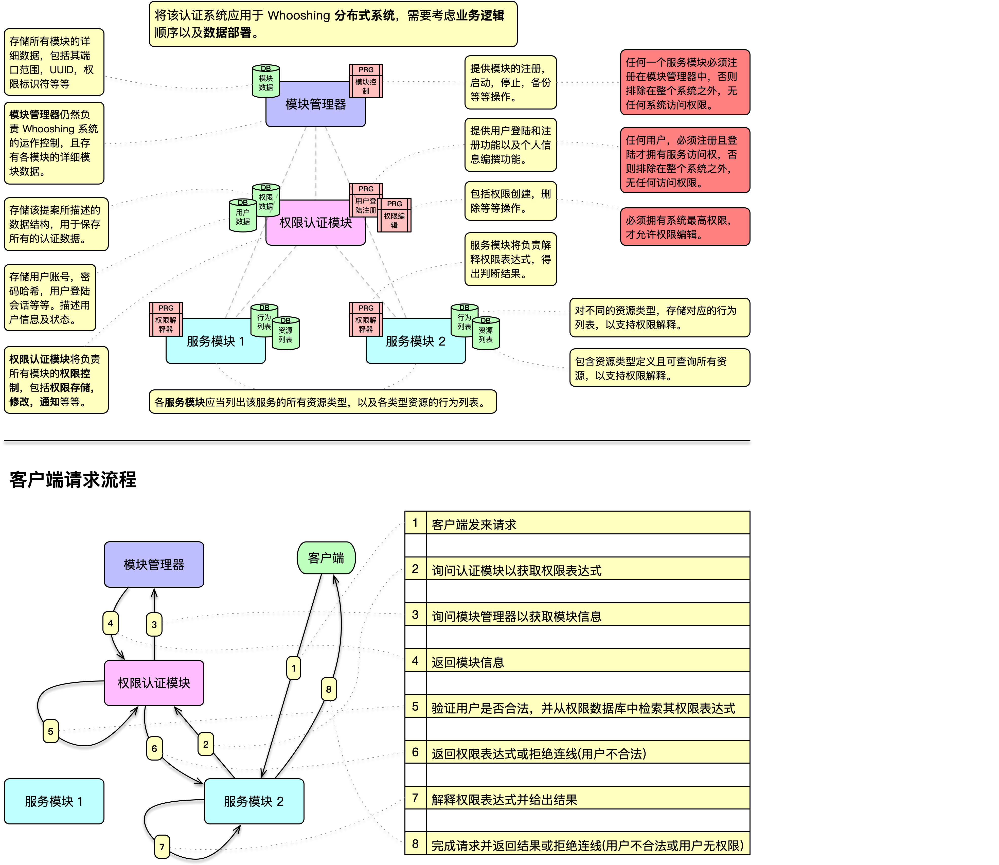
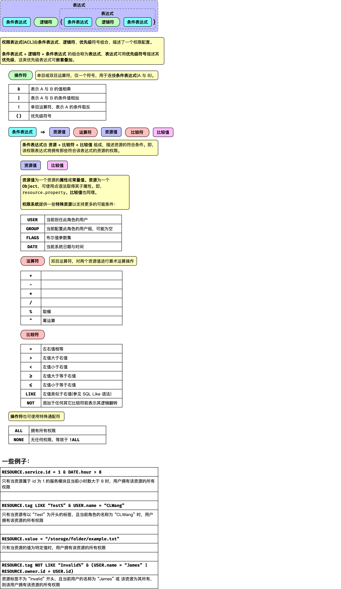
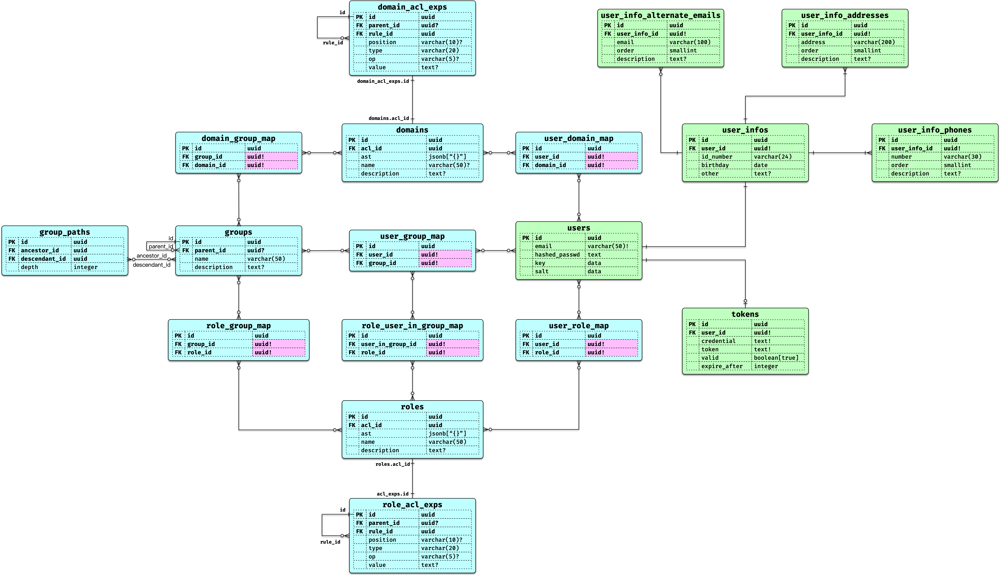

# **Whooshing 权限管理依赖库（未完成）**

该依赖库负责维护 **权限管理的数据结构**，并为 Whooshing 系统及其各服务模块提供全面的 **访问控制与权限管理** 功能。

它涵盖了 **权限授予、群组权限、用户权限、资源访问限制** 等多个层面，为系统提供灵活、高可扩展的权限解决方案。

另见 [Whooshing Privilege Module](https://github.com/SJJC-Team/whooshing.toolbox-privilege-module), 其用于辅助本模块完成权限系统。

------

### **✨ 特性**

- **灵活的权限定义**：权限以表达式形式定义与解析，支持复用与组合，满足复杂业务需求。
- **严格的访问控制**：遵循最小权限原则，采用叠加式（非排除式）权限机制，确保安全边界清晰。
- **高度可定制**：允许自定义资源类型及其操作集合，从而实现精细化的权限管理。
- **结构化权限体系**：支持用户、群组及群组内权限层级定义，构建清晰的权限继承与隔离模型。
- **分布式架构设计**：与 Whooshing 系统深度集成，采用分布式思路实现低耦合的模块交互与高可靠性。
- **模块化实现**：以模块为单位组织功能，职责边界明确，便于扩展与维护。

---

### 结构设计

#### 模块业务及数据部署

#### 权限表达式

#### 数据结构 - ERD

要了解详细结构，请见[所有设计图](diagrams)

---

### 运行环境

* **macOS** (> 10.15)
* **iOS** (> 14.0)
* **Linux** (> 20)
* **Swift** (> 6.0)
* **watchOS** (> 6.0) **[未测试]**
* **tvOS**(> 13) **[未测试]**

---

### 联系与反馈

如有使用问题或建议，请通过 [GitHub Issues](https://github.com/SJJC-Team/whooshing.toolbox-privilege-system/issues) 提交反馈。

或发至邮箱 [contact@official.whooshings.space](mailto:contact@official.whooshings.space)

